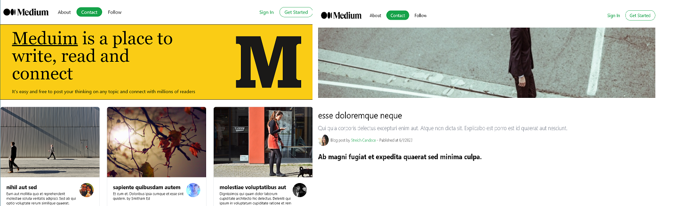

# Meduim Next.js + Tailwind CSS + ISR

<!-- TABLE OF CONTENTS -->

## Table of Contents

- [About the Project](#about-the-project)
- [Built With](#built-with)
- [Incremental Static Regeneration](#incremental-static-regeneration)
- [Getting Started](#getting-started)
- [License](#license)

## About the Project

> The <b>Meduim-clone</b> web application presents a custom Meduim-clone.
>  
> The APP is created with the latest industry standards using React.js NextJs ISR
>  

## Screenshot

## Built With

This project was built using these technologies.

- React.js
- Next Js + ISR
- GitHub

## Incremental Static Regeneration
<b>Next.js</b> allows you to create or update static pages after you've built your site. Incremental Static Regeneration (ISR) enables developers and content editors to use static-generation on a per-page basis, without needing to rebuild the entire site. With ISR, you can retain the benefits of static while scaling to millions of pages.

Static pages can be generated at runtime (on-demand) instead of at build-time with ISR. Using analytics, A/B testing, or other metrics, you are equipped with the flexibility to make your own tradeoff on build times.

Consider an e-commerce store with 100,000 products. At a realistic 50ms to statically generate each product page, the build would take almost 2 hours without ISR. With ISR, we can choose from:

**Faster Builds**  → Generate the most popular 1,000 products at build-time. Requests made to other products will be a cache miss and statically generate on-demand: 1-minute builds. 
**Higher Cache Hit Rate**  → Generate 10,000 products at build-time, ensuring more products are cached ahead of a user's request: 8-minute builds.
## Getting Started

**To get this project set up on your local machine, follow these simple steps:**

**Step 1** 
Navigate through the local folder where you want to clone the repository and run 
`https://github.com/ziedak/meduim_clone.git meduim_clone`. It will clone the repo to your local folder. 
**Step 2** 
Run `cd meduim_clone` 
**Step 3** 
Run `yarn install` to install the yarn packages from the `package.json` file. 
**Step 4** 
Run `yarn start` to start the webpack server, you can now navigate to `http://localhost:3000` to view the app. The server refreshes the app every time you make a change to a file used by it. 
**Step 5** 
Most important, enjoy the app! 

## Tests

1. Open Terminal

2. Install dependencies (only if you did not install them previously):

   `yarn install`

3. Run the tests with the command:

   `yarn test`

## License

This project is [MIT](https://opensource.org/licenses/MIT) licensed.

## Show your support

If you've read this far....give me a ⭐️!
